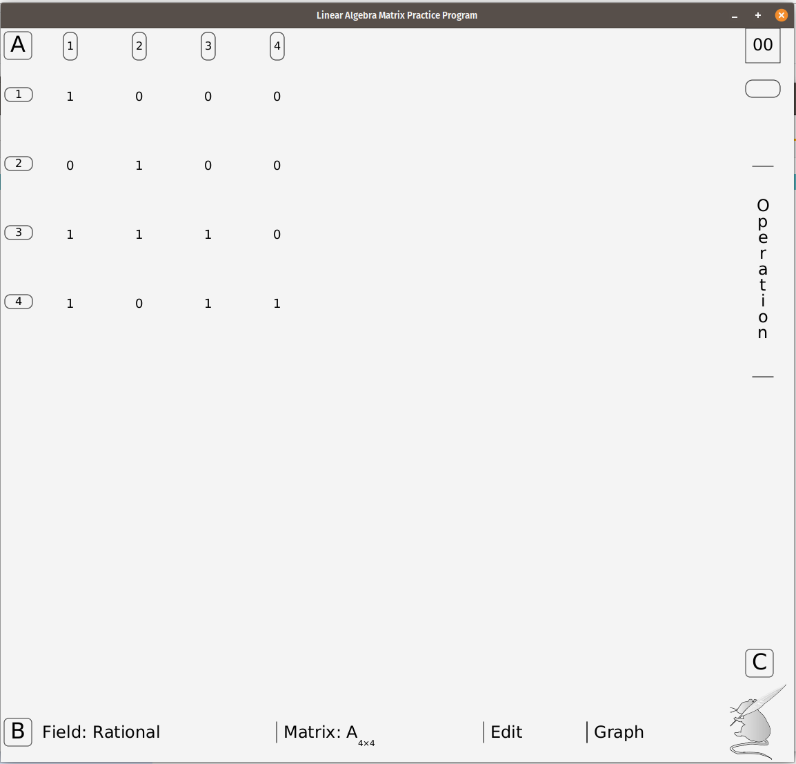
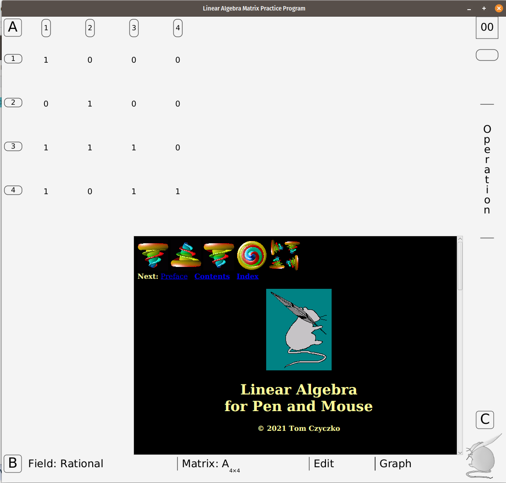
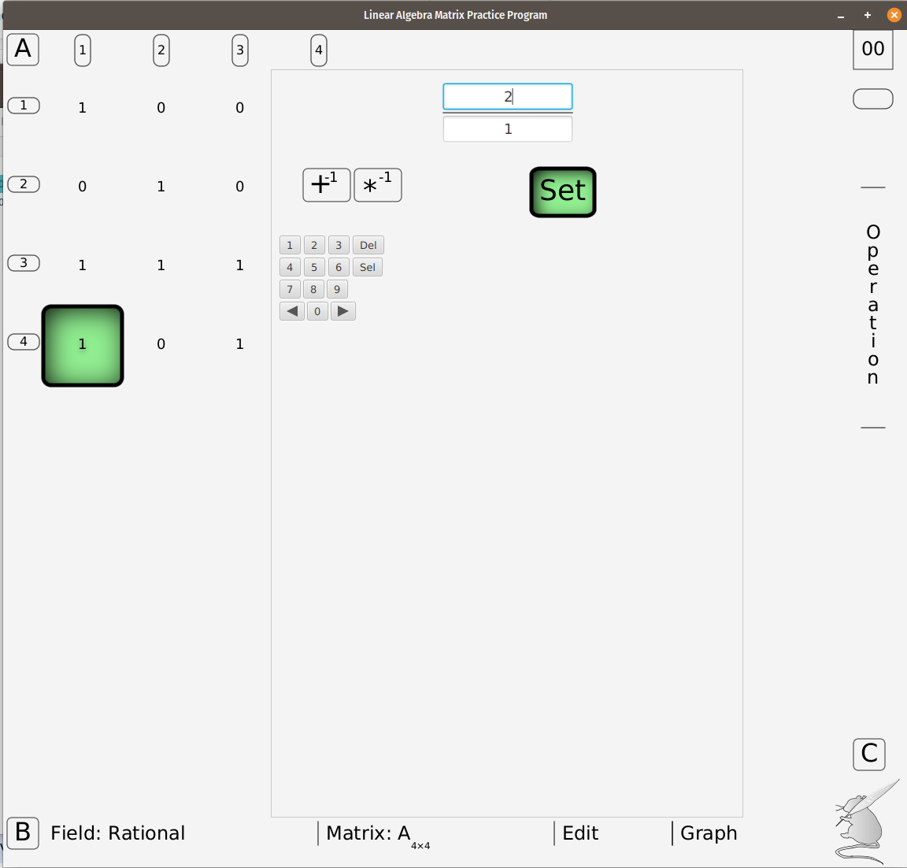
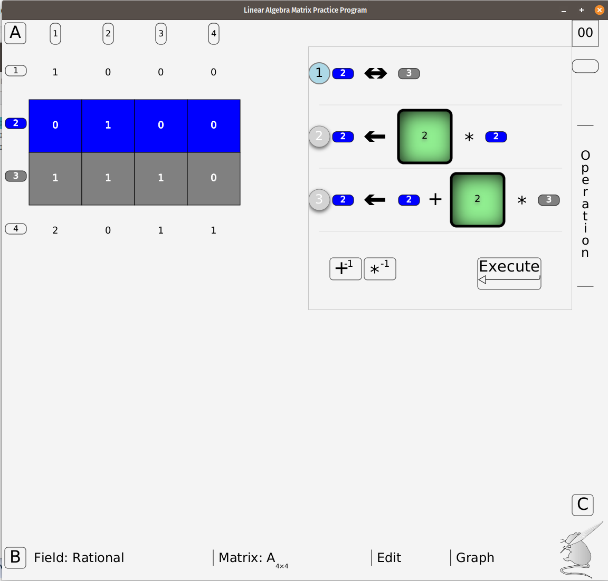
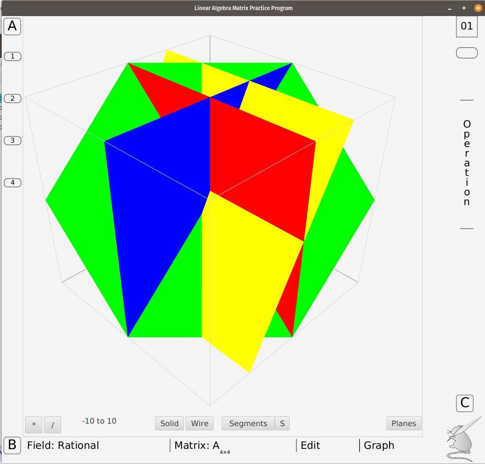
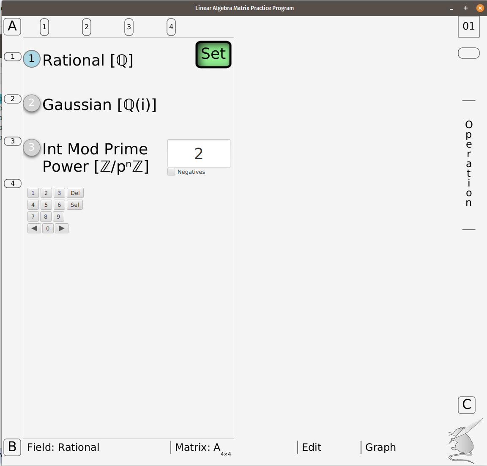

# LAMPP - A Package for Introducing Linear Algebra
   

**LAMPP** is two things:

**Linear Algebra Matrix aPP**: an application that runs on Linux, Windows, Android (soon?), and iOS (eventually?). It is used to work out LA problems and exercises. The UI was designed to resemble an old-fashioned lecture room whiteboard.

**Linear Algebra for Mouse, Pad and Pen**: a textbook on Linear Algebra designed for high school students and people who have been away from mathematics for awhile. Knowledge of calculus or analytic geometry is not assumed.

The two are designed to be used together in that the LAMPP app capabilities are unlocked from keys given in the book. For example, matrix inverses are evaluated using row operations before the necessary information is given to allow LAMPP to calculate inverses with one button.

 The LAMPP app is designed to use subsets of several different number fields: the Rational, the Gaussian (complex with rational coefficients) and Integers modulus a specified Prime. Initially students use row operations to accomplish tasks. A limited graphing capability is also included to give a "rough" idea of how one might associate geometry with matrices. The impetus is to eliminate the mistake-prone arithmetic used when doing matrix calculations by hand.

 HTML files kept here are intended as an extra source of pictures and animations to illustrate some of the concepts introduced in the LAMPP book. This site may be accessed by a browser or by activating the mouse icon on the lower right of the LAMPP app screen. 

## Thank You! 

This repo is just starting out (after over 20 years!) I hope to be able to have more easily installed versions available **RSN** (Real Soon Now.) After I make the program modular, I have to figure out why jpackage (which, even for a simple test case) is **not** working on my pop-os Linux machine.)

## Screenshots 

|                    Lampp with 4X4 matrix                     |            Help Browser Panel Selected            |
| :-------------------------------------------------: | :-------------------------------------------------: |
|  |  |

|              Edit Panel Opened              |             Rows and Row Operation Selected              |
| :-------------------------------------------------: | :-------------------------------------------------: |
|  |  |

|             4X4 Rational Matrix Shown as Graph             |         Number Field Selections          |
| :------------------------------------------------: | :------------------------------------------------: |
|  |  |

## Requirements ✅

* [Java](https://github.com/graalvm/graalvm-ce-builds/releases/) SDK 22 or higher, [JavaFX](https://gluonhq.com/products/javafx/) 20.0.2 at highest (for HTML animated GIFs to show properly in Browser Help Panel.) Actually, Java 8 would probably still compile and execute without need for separate JavaFX modules. A [Maven](https://maven.apache.org/) installation would be very useful, though not strictly necessary.

## Installation 🛠️
1. Press the **Fork** button (top right the page) to save copy of this project on your account. In Linux, your local Lampp directory should be under your Home directory to use the batch script as written in 000README.txt.

2. Download the repository files (project) from the download section or clone this project by typing in the bash the following command:

       git clone https://github.com/tczyczko/Lampp.git

3. Note that there are two copies of img.tar.gz given, one in **target/classes/html** and one in **src/main/resources/html**. These must be uncompressed locally using tar (Linux) or 7-Zip (Windows) before running or compiling the program. They were compressed because of GitHub's limit on the number of files. See 000readme.txt for more details. The target/Lampp-0.0.1-SNAPSHOT.jar file WILL run without access to these files, but will be missing images. Again, see 000readme.txt for details on how to run the program. [java --module-path $PATH_TO_FX --add-modules javafx.controls,javafx.web -jar target\Lampp-0.0.1-SNAPSHOT.jar] --- I intend to fix this RSN.

4. Use the POM file with Maven to run or build the java program. See 000README.txt for specific and more detailed setup instructions.   After installing Maven, a JDK and JavaFX (pointed to by $PATH_TO_FX), the simplest two commands (to create a jar file and run it without warnings in Linux) are:

   $mvn package

   $java  --sun-misc-unsafe-memory-access=allow --enable-native-access=ALL-UNNAMED,javafx.graphics,javafx.web --module-path $PATH_TO_FX --add-modules javafx.controls,javafx.graphics,javafx.web -jar ./target/Lampp-0.0.1-SNAPSHOT.jar

5. The accompanying textbook (a work in progress) is given as a PDF, an epub and HTML files. It is written in  , and processed using [LaTeXML](https://math.nist.gov/~BMiller/LaTeXML/), so it uses the most basic and necessary LaTeX that can be processed into epub and HTML by LaTeXML. 

6. An old Android debug apk file is included that was created long ago using an early Gluon netbeans plugin and Java 8. It can still be side-loaded on many Android tablets to demonstrate the use of touch gestures.

## Contributing 💡
If you want to contribute to this project (by adding other number fields perhaps? Or suggesting problems that need the Integer Modulus a Prime number field?), your pull request or comments will be welcomed.
If you find any issue just put it in the repository issue section. Suggestions for directions for further development will also be welcomed. Remember, though, Lampp is for very low level (though strictly correct) instruction . It was created to allow a student to "play" with the ideas of elementary Linear Algebra (which should, really, be introduced even before calculus.)
