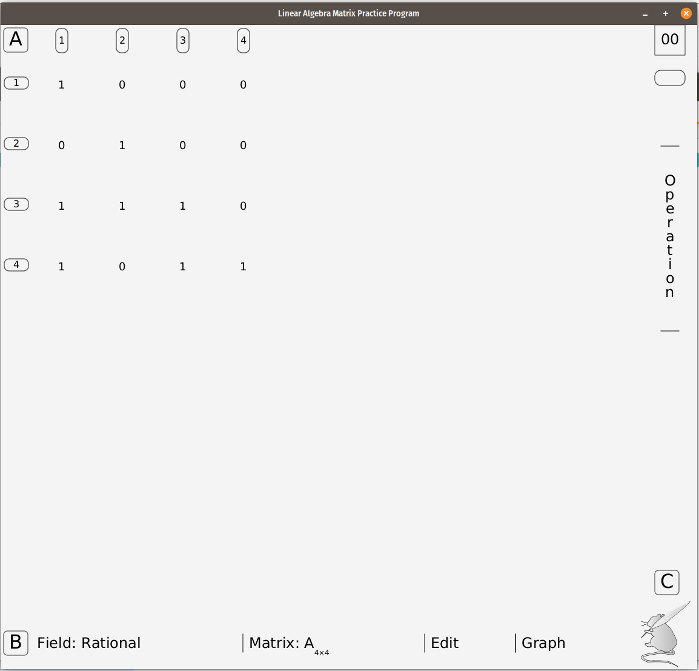
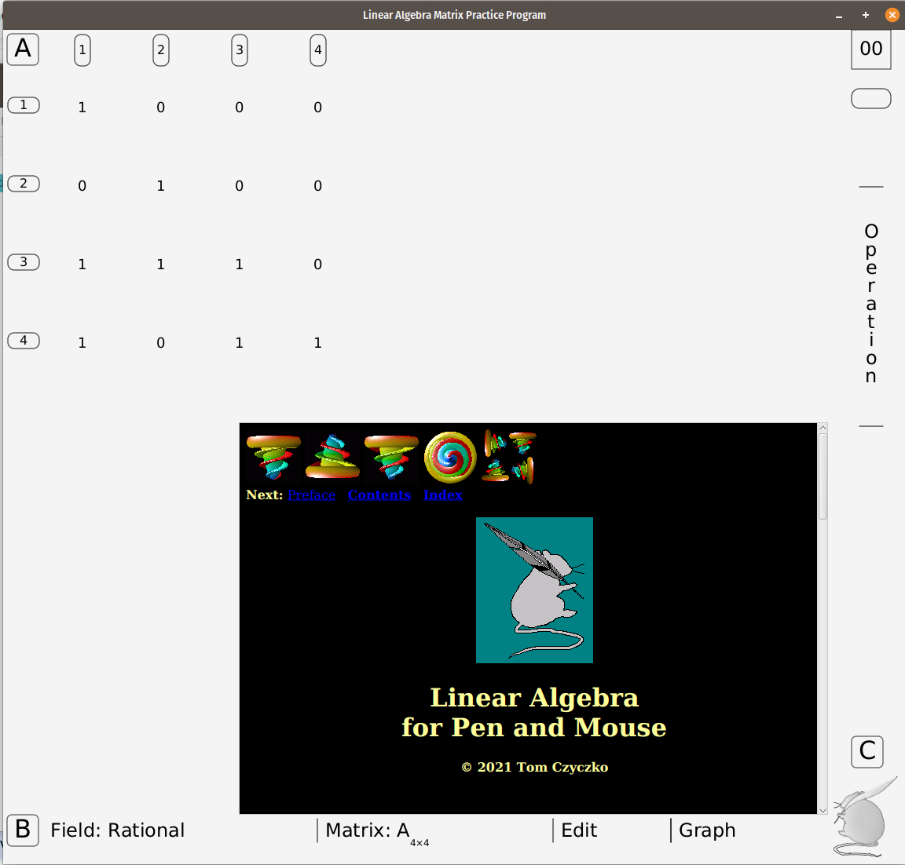
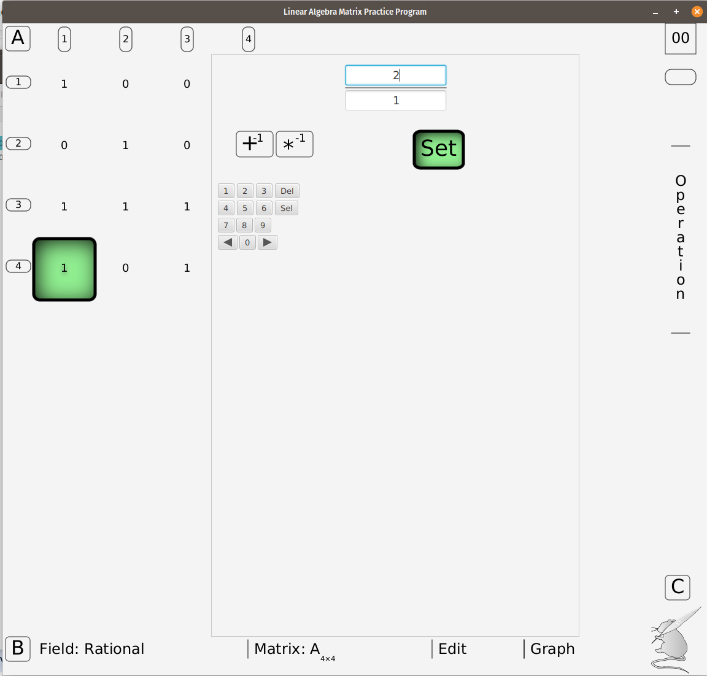
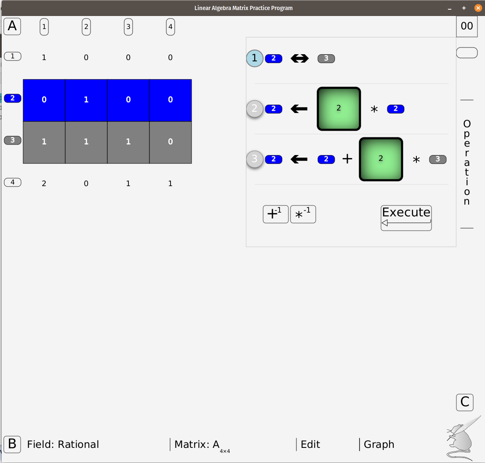
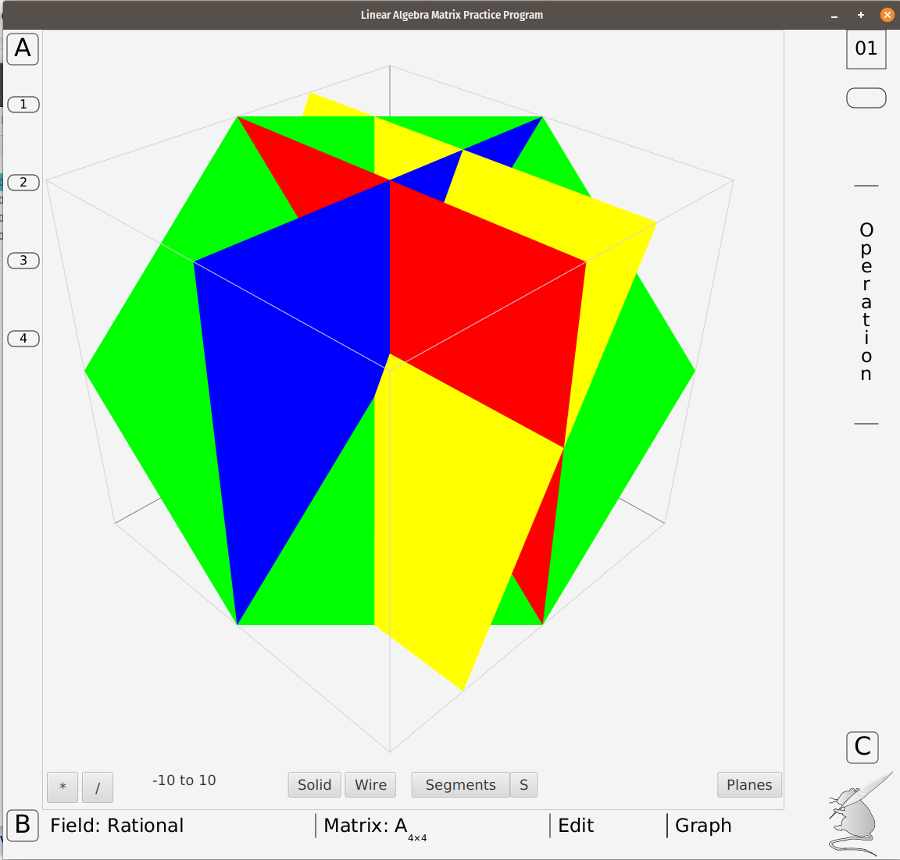
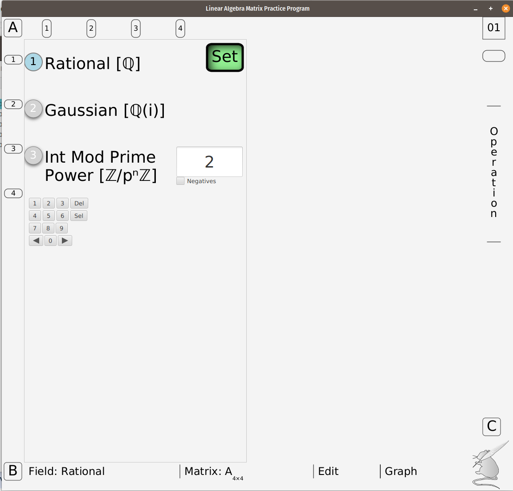

# LAMPP - A Package for Introducing Linear Algebra
   

**LAMPP** is two things:

**Linear Algebra Matrix aPP**: an application that runs on Linux, Windows, Android (soon?), and iOS (eventually?). It is used to work out LA exercises. The UI was designed to resemble an old-fashioned lecture room whiteboard.

**Linear Algebra for Mouse, Pad and Pen**: a textbook on Linear Algebra designed for high school students and people who have been away from mathematics for awhile. Knowledge of calculus or analytic geometry is not assumed.

The two are designed to be used together in that the LAMPP app capabilities are unlocked from keys given in the book. For example, matrix inverses are evaluated using row operations before the necessary information is given to allow LAMPP to calculate inverses with one button.

 The LAMPP app is designed to use subsets of several different number fields: the Rational, the Gaussian (complex with rational coefficients) and Integers modulus a specified Prime. Initially students use row operations to accomplish tasks. A limited graphing capability is also included to give a "rough" idea of how one might associate geometry with matrices. The impetus is to eliminate the mistake-prone arithmetic used when doing matrix calculations by hand.

 HTML files kept here are intended as an extra source of pictures and animations to illustrate some of the concepts introduced in the LAMPP book. This site may be accessed by a browser or by activating the mouse icon on the lower right of the LAMPP app screen. 

## Thank You! 

This repo is just starting out (after over 20 years!) I hope to be able to have more easily installed versions available **RSN** (Real Soon Now.) After I make the program modular, I have to figure out why jpackage (which, even for a simple test case) is **not** working on my pop-os Linux machine.)

## Screenshots 

|                    Lampp with 4X4 matrix                     |            Help Browser Panel Selected            |
| :-------------------------------------------------: | :-------------------------------------------------: |
|  |  |

|              Edit Panel Opened              |             Rows and Row Operation Selected              |
| :-------------------------------------------------: | :-------------------------------------------------: |
|  |  |

|             4X4 Rational Matrix Shown as Graph             |         Number Field Selections          |
| :------------------------------------------------: | :------------------------------------------------: |
|  |  |

## Requirements ✅

* [Java](https://www.oracle.com/java/technologies/javase/jdk22-archive-downloads.html) SDK 22.0.2 or higher, [JavaFX](https://gluonhq.com/products/javafx/) 20.0.2 at highest (for HTML animated GIFs to show properly in Browser Help Panel.) Follow the setup directions for the Java SDK and create the JAVA_HOME environment variable. For this project's **bat** and **sh** files, the Java SDK directory is assumed to be in $PWD/JDKs (for Linux) or %USERPROFILE%\JDKs (for Windows). 

 * JavaFX is available for Windows, Linux and/or macOS from GLUON https://gluonhq.com/products/javafx/ 
 
 * Remember to check the box to Include archived versions to get 22.0.2
Specific downloads from the GLUON website are given here:
      * **For Windows x64**
          - **Install** JavaFX 22.0.2    https://download2.gluonhq.com/openjfx/22.0.2/openjfx-22.0.2_windows-x64_bin-sdk.zip
          - setx PATH_TO_FX "%PATH%;C:\user\USERNAME\JDKs\javafx-sdk-22.0.2\lib"
          - **Install** JavaFX jmods (PATH_TO_FX_MODS) https://download2.gluonhq.com/openjfx/22.0.2/openjfx-22.0.2_linux-x64_bin-jmods.zip
          - setx PATH_TO_FX_MODS "%PATH%;C:\user\USERNAME\JDKs\javafx-jmods-22.0.2"
      * **For Linux x64**
          - **Install** JavaFX 22.0.2    https://download2.gluonhq.com/openjfx/22.0.2/openjfx-22.0.2_linux-x64_bin-sdk.zip
          - export PATH_TO_FX=/home/USERNAME/JDKs/javafx-sdk-22.0.2/lib
          - export PATH=$PATH_TO_FX:$PATH
          - **Install** JavaFX jmods (PATH_TO_FX_MODS) https://download2.gluonhq.com/openjfx/22.0.2/openjfx-22.0.2_linux-x64_bin-jmods.zip
          - export PATH_TO_FX_MODS=/home/USERNAME/JDKs/javafx-jmods-22.0.2

Usually the directories for the JavaFX sdk, the JavaFX jmods, and any alternative JDK are placed into a directory called JDKs and variables like JAVA_HOME, PATH_TO_FX and PATH_TO_FX_MODS are set to point to these new directories.

* A [Maven](https://maven.apache.org/) installation should also be installed.

## Installation 🛠️
1. Press the **Fork** button (top right the page) to save copy of this project on your account. In Linux, your local Lampp directory should be under your Home ($PWD) directory. In Windows, the local Lampp directory should be placed under your user (%USERPROFILE%) directory.

2. Download the repository files (project) from the download section or clone this project by typing in a terminal the following command:

       git clone https://github.com/tczyczko/Lampp.git

3. For Windows:

       cd %USERPROFILE%\Lampp

   For Linux:

       cd $PWD/Lampp

4. After installing Maven, a JDK and JavaFX (pointed to by $PATH_TO_FX or %PATH_TO_FX%), use the provided Windows **bat** file or the Linux **sh** file to get Maven to execute the POM file to build the java program. **NOTE:** It may be necessary to give the proper permissions to allow a **bat** or **sh** file to execute as a program.

   For Windows:

       LAMPP_WINDOWS_COMPILE.bat

   For Linux:

       ./LAMPP_LINUX_COMPILE.sh

5. After compiling, use the provided Windows **bat** file or the Linux **sh** file to run the Lampp java program.

   For Windows:

       LAMPP_WINDOWS_RUN.bat

   For Linux:

       ./LAMPP_LINUX_RUN.sh

6. **ALTERNATIVELY**, compile and create the executable jar file using Maven

   For Windows or Linux:
  
       mvn clean package

7. To execute the Lampp program:

   For Windows:
 
       java --module-path %PATH_TO_FX% --add-modules javafx.graphics,javafx.web -jar target\Lampp-0.0.1-SNAPSHOT.jar

   For Linux (with options to suppress warnings):
  
       java  --enable-native-access=ALL-UNNAMED,javafx.graphics,javafx.web  --module-path $PATH_TO_FX --add-modules javafx.graphics,javafx.web -jar target/Lampp-0.0.1-SNAPSHOT.jar

8. The accompanying textbook (a work in progress) is given in PDF and [HTML](https://tczyczko.github.io/Lampp/) (in the **docs** subdirectory). It is written in  , and processed using [LaTeXML](https://math.nist.gov/~BMiller/LaTeXML/), so it uses the most basic and necessary LaTeX that can be processed into epub and HTML by LaTeXML. 

9. An old Android debug apk file is included that was created long ago using an early Gluon netbeans plugin and Java 8. It can still be side-loaded on many Android tablets to demonstrate the use of touch gestures.

## Contributing 💡
If you want to contribute to this project (by adding other number fields perhaps? Or suggesting problems that need the Integer Modulus a Prime number field?), your pull request or comments will be welcomed.

If you find any issue just put it in the repository issue section. Suggestions for directions for further development will also be welcomed. Remember, though, Lampp is for very low level (though strictly correct) instruction . It was created to allow a student to "play" with the ideas of elementary Linear Algebra (which should, really, be introduced even before calculus.)
